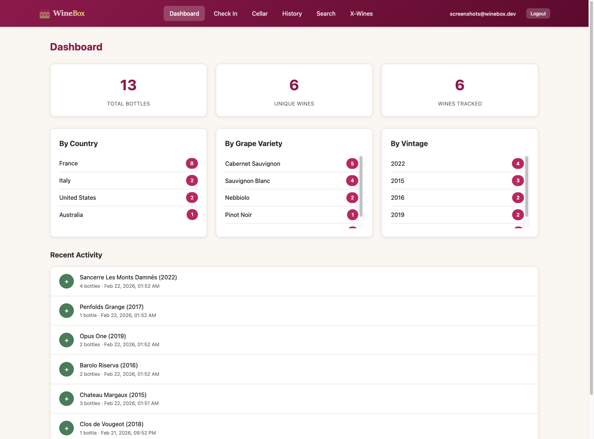
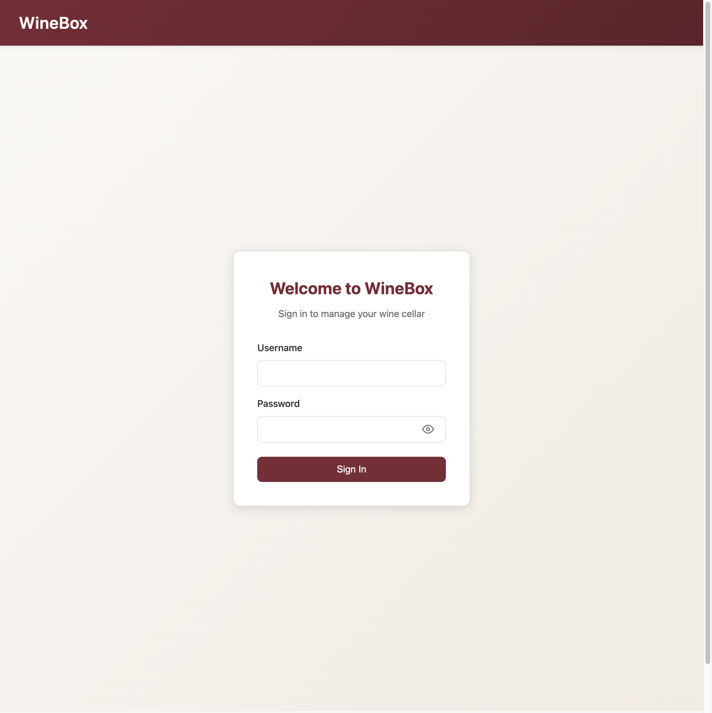
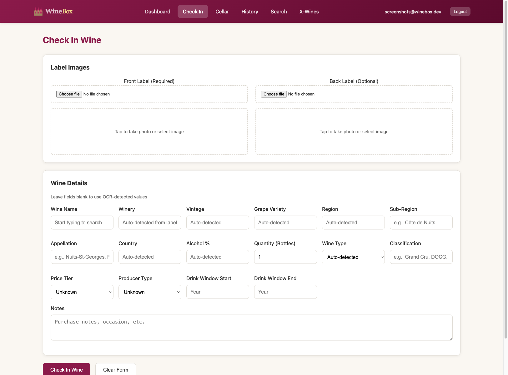
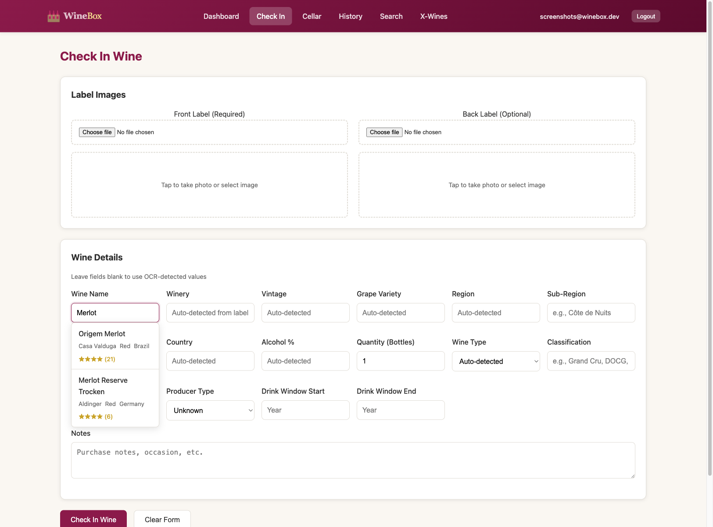
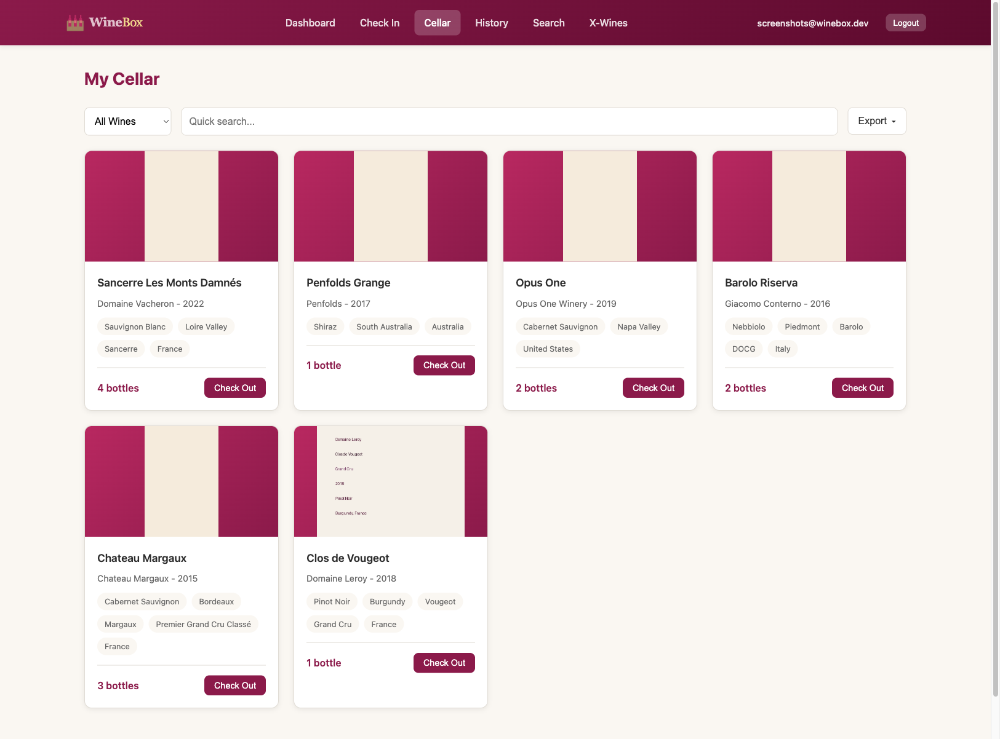
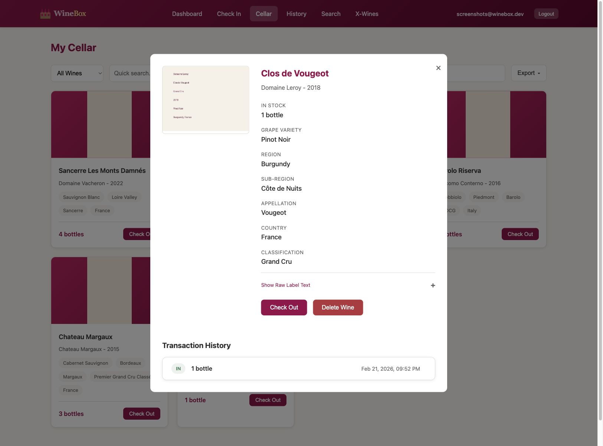
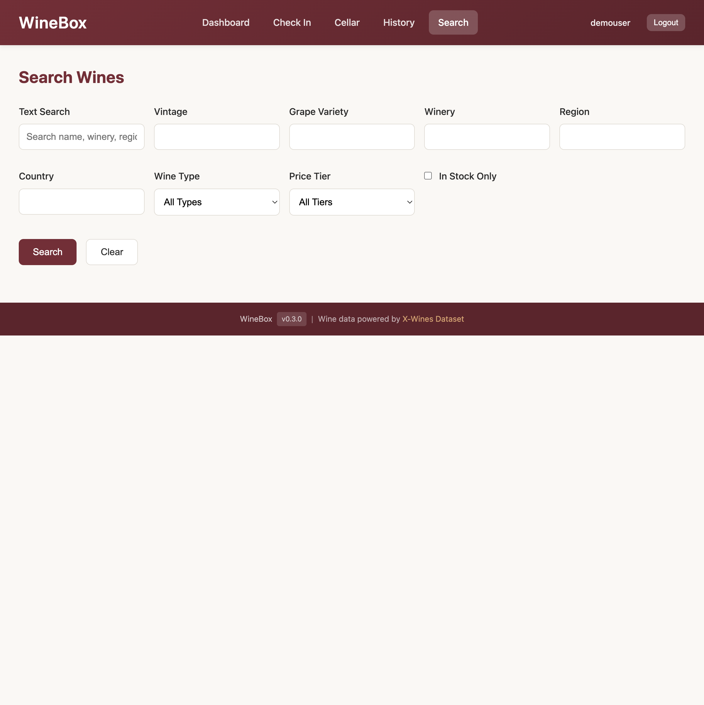
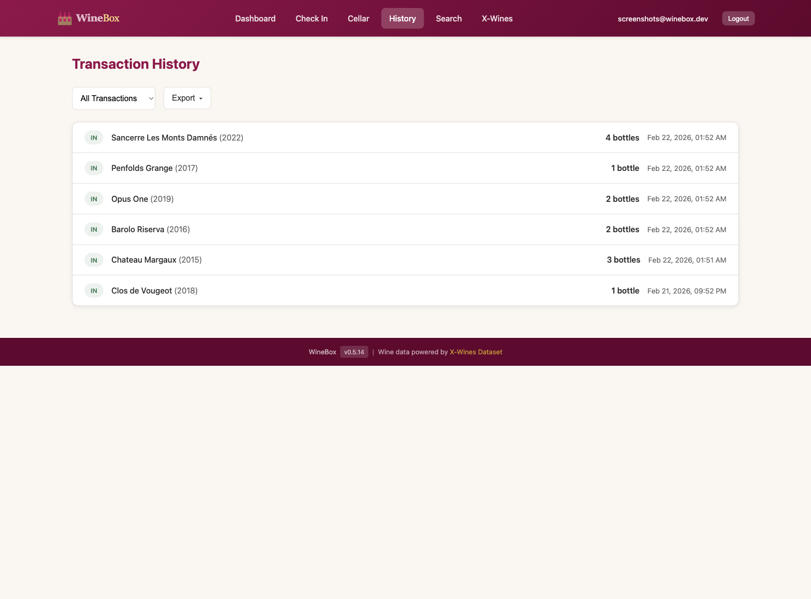

# WineBox Documentation

Welcome to WineBox, your personal wine cellar management application.

## What is WineBox?

WineBox helps you keep track of your wine collection with ease:

- **Scan wine labels** - Take a photo of a wine label and WineBox automatically extracts the details using AI
- **Smart autocomplete** - Start typing a wine name and get suggestions from over 100,000 wines with community ratings
- **Track your inventory** - Check bottles in and out, and always know what's in your cellar
- **Search and filter** - Find any wine by name, vintage, grape, region, appellation, or country
- **View history** - See a complete log of every bottle added or removed


*The dashboard gives you a quick overview of your cellar*

## Getting Started

### Installation

Install WineBox using pip:

```bash
pip install winebox
```

Or with pipx for isolated installation:

```bash
pipx install winebox
```

### Starting the Server

```bash
# Start WineBox server
winebox-server start

# Start on a different port
winebox-server start --port 8080

# Check server status
winebox-server status

# Stop the server
winebox-server stop
```

### Creating Your First User

```bash
winebox-admin add myemail@example.com --password mypassword
```

### First Login

1. Open your browser to **http://localhost:8000/static/index.html**
2. Log in with the email and password you created


*The WineBox login page*

### Configuration

WineBox uses TOML-based configuration. Create a `config.toml` file in your project root or use environment variables:

```bash
# Copy example configuration
cp config/config.toml.example config.toml
cp config/secrets.env.example secrets.env

# Edit secrets (add your API keys)
nano secrets.env
```

See [Configuration](configuration.md) for full details.

### Setting Up AI Label Scanning (Optional)

WineBox can use Claude Vision AI for intelligent label scanning. To enable it:

1. Get an API key from [Anthropic](https://console.anthropic.com/)
2. Add to your `secrets.env` file:
   ```bash
   WINEBOX_ANTHROPIC_API_KEY=your-api-key-here
   ```

Without an API key, WineBox falls back to Tesseract OCR. Install it with:
- **macOS**: `brew install tesseract`
- **Ubuntu/Debian**: `sudo apt-get install tesseract-ocr`

## Using WineBox

### Adding Wine to Your Cellar

The **Check In** page lets you add wines to your collection:

1. Click **Check In** in the navigation
2. **Upload a photo** of the front label (required)
3. **Wait for AI scanning** - the form fields populate automatically
4. **Use autocomplete** (optional) - type in the Wine Name field to search 100K+ wines
5. **Review and edit** any details as needed
6. Click **Check In Wine**


*The check-in form with label upload and wine details*

#### Smart Autocomplete

When you start typing in the Wine Name field, WineBox suggests matching wines from the X-Wines dataset:


*Autocomplete shows matching wines with ratings*

Select a suggestion to auto-fill the winery, country, and alcohol percentage.

### Viewing Your Cellar

The **Cellar** page shows all your wines:

- Filter by: All Wines, In Stock Only, or Out of Stock
- Quick search by name or winery
- Click any wine card to see details


*Your wine cellar with bottle counts*

### Wine Details

Click on any wine to see its full details:

- Label image
- Wine information (region, sub-region, appellation, country, classification, alcohol %)
- Current stock count
- Transaction history
- Check Out and Delete buttons


*Wine detail modal showing all information*

### Checking Out Wine

When you drink or remove a bottle:

1. Find the wine in your **Cellar**
2. Click the **Check Out** button
3. Enter the quantity
4. Add optional notes (occasion, tasting notes)
5. Click **Check Out**

### Searching Your Cellar

The **Search** page provides advanced filtering:


*Advanced search with multiple filters*

Available filters:
- Text search (name, winery, region, sub-region, appellation)
- Vintage year
- Grape variety
- Country
- Wine type (Red, White, Rosé, etc.)
- Price tier
- In stock only

### Transaction History

The **History** page shows all your check-ins and check-outs:


*Complete transaction history*

Filter by:
- All transactions
- Check-ins only
- Check-outs only

## Tips for Best Results

### Taking Good Label Photos

For the best AI scanning results:

1. **Good lighting** - natural light works best
2. **Hold steady** - avoid blurry photos
3. **Capture the full label** - get all text in frame
4. **Front labels** - required for scanning
5. **Back labels** - optional but adds more details

### Organizing Your Collection

- Use consistent wine names when editing
- Always include the vintage when known
- Add the grape variety for better searching
- Include region and country for filtering

### Backing Up Your Data

Your data is stored in MongoDB and the filesystem:
- **Database**: MongoDB database `winebox` (default)
- **Images**: `data/images/`

Back up your MongoDB database and images directory regularly:

```bash
# Backup MongoDB
mongodump --db winebox --out backups/

# Backup images
tar -czf backups/images.tar.gz data/images/
```

## Command Reference

### Server Management

```bash
winebox-server start              # Start server (background)
winebox-server start --foreground # Start in foreground
winebox-server start --port 8080  # Use different port
winebox-server start --reload     # Auto-reload on changes (dev)
winebox-server stop               # Stop server
winebox-server restart            # Restart server
winebox-server status             # Check if running
```

### User Management

```bash
winebox-admin add EMAIL --password PASS    # Create user
winebox-admin list                         # List all users
winebox-admin passwd EMAIL --password PASS # Change password
winebox-admin disable EMAIL                # Disable user
winebox-admin enable EMAIL                 # Enable user
winebox-admin remove EMAIL                 # Delete user
```

## Contents

```{toctree}
:maxdepth: 2
:caption: Documentation

user-guide
configuration
deployment
api-reference
```

## License

MIT License
